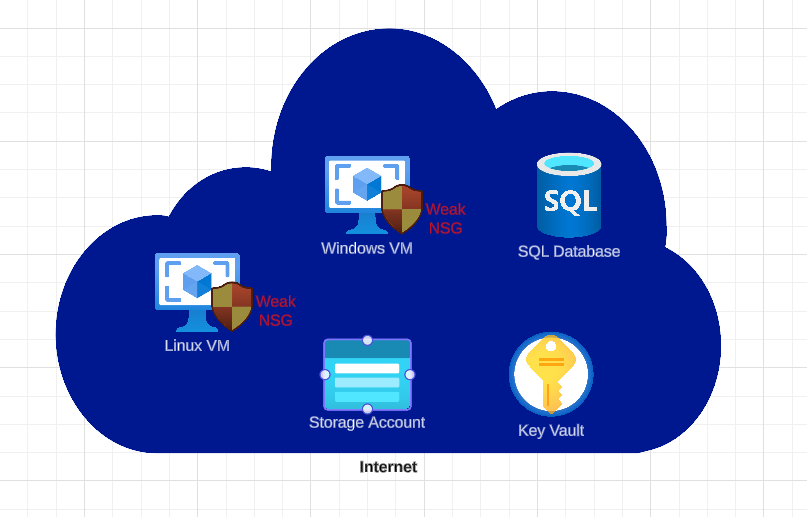
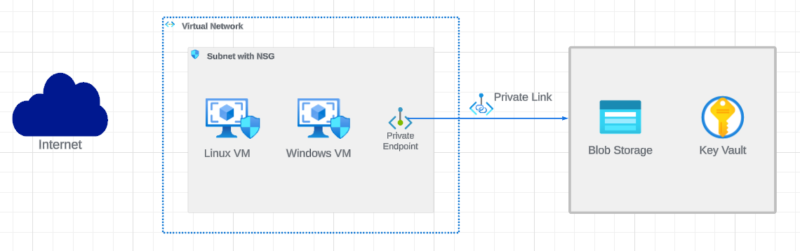
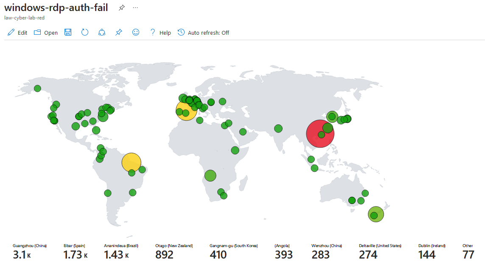
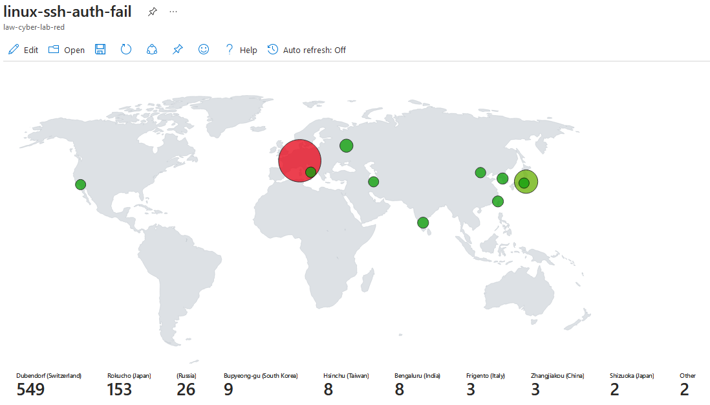
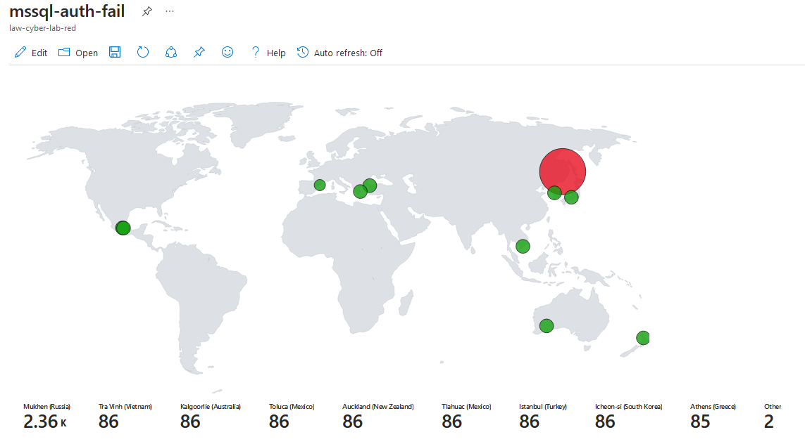
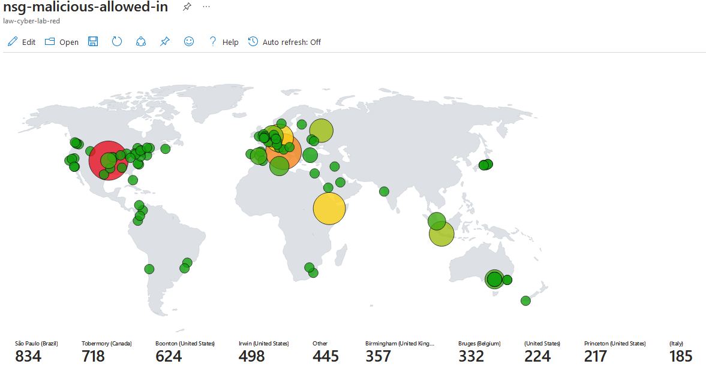

## Introduction

In this lab, I built a small-scale honeynet where I initially used it to gather telemetries of malicious activities targeting my resources in Log Analytics Workspace. These logs would then be integrated into Azure’s SIEM, Sentinel for visualizing the malicious logs in the form of attack maps and also creating alert rules for specific incidents. The honeynet or insecure environment would be left running for 24-hour to take snapshots of the logs within that time period. Subsequently, after 24 hours of implementing security controls making the environment secure, another snapshot is taken. These captured snapshots of the environment pre and post hardening will be compared to gauge the effectiveness of the security controls put into place.

The snapshots consists of the metrics for following events:
- SecurityEvent (Windows Event Logs)
- Syslog (Linux Event Logs)
- SecyrityAlert (Log Analytics Alert Triggered)
- SecurityIncident (Incidents created by Sentinel)
- AzureNetworkAnalytics_CL (Malicious Flows allowed into the honeynet)

## Diagram of the lab


## Topology Before Hardening / Security Controls
This is the topology of the lab before implementing security controls. The resources are out there completely exposed to the internet. The virtual machines's Network Security Groups and built-in firewalls are configured to allow all inbound traffic. Azure Key Vault and Storage Account are deployed with public endpoints visible to the Internet.



## Topology After Hardening / Security Controls
This is the topology of the lab after implementing security controls. The resources are now secured and are no longer exposed to the internet. The virtual machines's Network Security Grups are configured to only allow traffic from my personal computer. In addition, a Netowrk Security Group is added to the subnet. Azure Key Vault and Storage Account are secured by enabling private link and firewall configurations.


## Attack Maps Before Hardening / Security Controls
<b>Attack map of malicious actors's failed attempt at brute-forcing through Windows VM via RDP</b>
<br>

<b>Attack map of malicious actors's failed attempt at brute-forcing through Linux VM via SSH</b>
<br>

<b>Attack map of malicious actors's failed attempt at brute-forcing through SQL Database </b>
<br>

<b>Attack map of all malicious traffic allowed by the Network Security Group</b>
<br>

## Snapshot Before Hardening / Security Controls
The following table shows the metrics we measured in our insecure environment for 24 hours:
Start Time 2024-01-24 19:00
Stop Time 2023-03-16 19:00

| Metric                   | Count
| ------------------------ | -----
| SecurityEvent            | 27373
| Syslog                   | 1978
| SecurityAlert            | 37
| SecurityIncident         | 179
| AzureNetworkAnalytics_CL | 3850

## Attack Maps Before Hardening / Security Controls
```All map queries actually returned no results due to no instances of malicious activity for the 24 hour period after hardening.```

## Snapshot After Hardening / Security Controls
The following table shows the metrics we measured in our environment for another 24 hours, but after we have applied security controls:
Start Time 2024-01-27 19:00
Stop Time	2024-01-28 19:00

| Metric                   | Count
| ------------------------ | -----
| SecurityEvent            | 5155
| Syslog                   | 5
| SecurityAlert            | 0
| SecurityIncident         | 0
| AzureNetworkAnalytics_CL | 0

## Impact of Security Controls
The following table shows the effectiveness of the implemented security controls by the percentage of reduction in the number of events. 

| Metric                   | Impact
| ------------------------ | --------
| SecurityEvent            | -81.17 %
| Syslog                   | -99.75 %
| SecurityAlert            | -100.00 %
| SecurityIncident         | -100.00 %
| AzureNetworkAnalytics_CL | -100.00 %

## Conclusion
In this lab, I built a small-scale honeynet in Azure and collected logs from multiple resources that are forwarded into a central log repository, Log Analytics Workspace. Sentinel will then be utilized to create attack maps and alerts of incidents from the ingested logs. Following this, I took snapshots of the enviornment before and after implementing security controls to assess their effectiveness.
